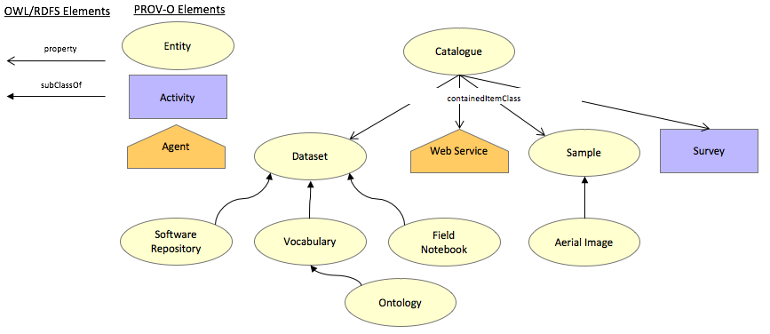

# GA's Public Data Model ontology
An OWL ontology for GA's public data and metadata at the dataset level.

The purpose of this ontology is to articulate what metadata and links to other things, at a minimum, can be expected of Geoscience Australia (GA)'s published items, such as datasets, web services and vocabularies. For example, if a dataset is published by GA, regardless of any domain-specific metadata that dataset might have, this ontology says it needs to have at least one keyword associated with it where the keyword is taken from a formal SKOS vocabulary.

This ontology contains classes for many things that GA publishes in [Linked Data](https://en.wikipedia.org/wiki/Linked_data) ways, such as datasets, key words, samples and web services. It also contains classes for things that facilitate the linking of other things, such as catalogues, which contain things like datasets, vocabularies, which contain keywords and agents (people or organisations) that publish things. The classes here are mostly just subclasses of things found in a few well-known ontologies, such as [DCAT](https://www.w3.org/TR/vocab-dcat/), [PROV](https://www.w3.org/TR/prov-o/) & [ORG](https://www.w3.org/TR/vocab-org/) with restrictions requiring certain metadata or relationships for them. 

At the time of this ontology's first publication (late 2017), most things classified by it and published by Ga do not meet this ontology's requirements. It is on-going work for GA to ensure that all datases, web services and so on are eventually published compliant with this ontology.

## Namespace & formal documentation
This ontology's namespace, which also links to its officail ontology documentation, is <http://pid.geoscience.gov.au/def/ont/ga/pdm>.

## Ontology documents
RDF (turtle): [pdm.ttl](pdm.ttl)  
HTML: [pdm.html](pdm.html)

## License
This repository is licensed under Creative Commons 4.0 International. See the [LICENSE deed](LICENSE) in this repository for details.

## Contacts
**William Francis**  
*Data Architect*  
Geoscience Australia  
<william.francis@ga.gov.au>  

**Margie Smith**  
*Data Governance & Policy*  
<margie.smith@ga.gov.au>  
<http://orcid.org/0000-0003-2696-189X>
