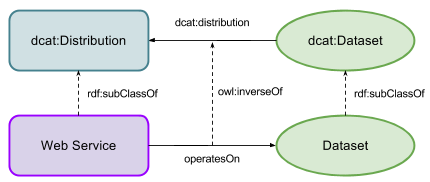

## Web Services
GA manages Web Services as items with dataset-like metadata and thus it may be expected that the they should be considerd a subclass of Dataset, however the maximally interoperable [Data Catalogue vocabulary (DCAT)](https://www.w3.org/TR/vocab-dcat/) sees things like Web Services as '[Distribution](https://www.w3.org/TR/vocab-dcat/#class-distribution)' class object, thus that is how we model Web Services, as shown in Figure 01.

In [ISO19115-1:2014 (Geographic information -- Metadata -- Part 1: Fundamentals)](http://www.iso.org/iso/iso_catalogue/catalogue_ics/catalogue_detail_ics.htm?csnumber=53798), the relationship between a Web Service and a Dataset is termled *operatesOn* and, from within a Web Service XML metadata record, the Datasets operated on can be found with the following XPath query:

`//mdb:MD_Metadata/mdb:identificationInfo/srv:SV_ServiceIdentification/srv:operatesOn/@xlink:*`

...with the following namespaces:

mdb: http://standards.iso.org/iso/19115/-3/mdb/1.0  
srv: http://standards.iso.org/iso/19115/-3/srv/2.0  
xlink: http://www.w3.org/1999/xlink  

  
Figure 01: Web Service <--> Dataset relations

In Figure 01, the GAPD operatesOn property is shown linking a Web Service and a Dataset and the relationships between peratesOn, Web Service and dataset and classes and properties in DCAT are shown.

It is not shown in the diagram for simplicity's sake but the GADP mandates a cardinality of 1+ for operatesOn, that is a Web Service must be shown to operatesOn at least one Dataset.
